# DH Tau B · Atmospheric Retrieval Pipeline Cookbook

> **Purpose**: Track every pipeline decision, branching point, and retrieval series.
> Use the flowchart to identify exactly where to "rewind" when a downstream result is wrong.
>
> **Target**: DH Tau B — young super-Jupiter companion
> **Instrument**: CRIRES+ K-band (K2166), nights 2022-12-31 and 2023-01-01
> **Last updated**: 2026-04-07
> **Working directory**: `/data2/peng/Recipe_DH_Tau_B/`
> **Primary log**: `/data2/peng/recording_recipe.md`

---

> **How to edit this flowchart**
> - Edit the Mermaid block below directly in any text editor.
> - Preview in VS Code: install the *Markdown Preview Mermaid Support* extension → open Preview.
> - Or paste the `flowchart TD ... ` block at **mermaid.live** for an interactive editor.
> - Status labels: `✅ Selected` · `❌ Abandoned` · `🔵 Alt branch` · `🟣 Planned` · `⭐ Current best`

---

## Pipeline Flowchart

```mermaid
---
id: 828b37af-4e78-41c9-bbb2-38d4a49d38d6
---
flowchart TD
    %% ── Colour classes ──────────────────────────────────────────
    classDef sel  fill:#1e5c1e,color:#fff,stroke:#143d14,stroke-width:2px
    classDef aban fill:#7a1a1a,color:#fff,stroke:#4d0f0f,stroke-width:2px
    classDef curr fill:#0c3d5c,color:#fff,stroke:#082a40,stroke-width:2px
    classDef plan fill:#3d2b5c,color:#fff,stroke:#28194d,stroke-width:2px
    classDef mile fill:#5c4a0c,color:#fff,stroke:#3d3008,stroke-width:3px
    classDef fix  fill:#1a3a3a,color:#cfc,stroke:#0d2525,stroke-width:1px,stroke-dasharray:4 3

    %% ── START ───────────────────────────────────────────────────
    START(["DH Tau B · CRIRES+ K-band<br/>Observations: 2022-12-31 and 2023-01-01"])

    %% ─────────────────────────────────────────────────────────────
    subgraph SG1 ["① Data Inspection"]
        LOOK["cooking_first_look.ipynb<br/>Two nights · visual check<br/>Companion signal confirmed above stellar halo"]
    end

    START --> LOOK
    LOOK --> D_EXTR{"Extraction<br/>approach?"}

    D_EXTR -- "🔵 Alt — on-disk fallback" --> EXCAL["excalibuhr SECONDARY<br/>Extr1D_SECONDARY_*.fits<br/>direct 1D extraction with remove_star_bkg=True"]
    D_EXTR -- "✅ Selected" --> CUSTOM["Custom extraction<br/>from 2D intermediate products"]

    %% ─────────────────────────────────────────────────────────────
    subgraph SG2 ["② Stellar PSF Subtraction"]
        SUBTR["cooking_subtraction.ipynb — night 12-31<br/>cooking_subtraction_0101.ipynb — night 01-01<br/>"]
    end

    CUSTOM --> SUBTR
    SUBTR --> D_PSF{"PSF model?"}

    D_PSF -- "tested" --> LANDMAN["Landman et al. approach<br/>→Transmission modeled"]
    D_PSF -- "✅ Selected" --> MOFFAT["Moffat + Polynomial fitting<br/>→ 2D spectrum with starlight removed, Transmission (mtrans) from the stanadard star"]

    %% ─────────────────────────────────────────────────────────────
    subgraph SG3 ["③ Spectrum Combination and Telluric Correction"]
        COMB["cooking_combine_spectra.ipynb<br/>Telluric correction via standard-star template"]
        FIX1["🔧 Fix 2026-03-28<br/>Error array: stellar-noise variance<br/>replaced by sky-based variance"]
        FIX2["🔧 Fix 2026-03-28<br/>Wrong error files loaded for flux-cal step<br/>corrected to post-extraction files"]
        COMB --- FIX1
        COMB --- FIX2
    end

    MOFFAT --> COMB
    COMB --> D_TELL{"Telluric<br/>treatment?"}

    D_TELL -- "🟣 Planned" --> TELL_MODEL["Model transmission<br/>in retrieval forward model<br/>model spectrum × mtrans<br/>avoids data ÷ mtrans instability"]
    D_TELL -- "✅ Selected" --> TELL_MASK["Mask and correct with<br/>standard-star telluric template<br/>(mtrans from molecfit)"]

    TELL_MASK --> D_MASK{"Mask<br/>threshold?"}

    D_MASK -- "❌ Previous — over-correction" --> M70["mtrans &lt; 0.70<br/>Spurious emission at telluric positions"]
    D_MASK -- "✅ Selected 2026-03-29" --> M80["mtrans &lt; 0.80<br/>Tighter masking — fewer artifacts"]

    M80 --> D_CAL{"Absolute flux<br/>calibration?"}

    D_CAL -- "🔵 Branch A — future use" --> FLUXCAL["Flux-calibrated spectra<br/>SINFONI reference (DHTaub_SINFONIspeclib_JHK.fits)<br/>Enables Radius parameter in retrieval"]
    D_CAL -- "✅ Current branch" --> NOCAL["No flux calibration<br/>Standard retrieval branch"]

    %% ─────────────────────────────────────────────────────────────
    subgraph SG4 ["④ RV Prior Derivation"]
        RVCAL["tasting_RV_prior.ipynb<br/>CCF vs cloud-free pRT grid (SONORA P-T profiles)<br/>Teff 2000–2400 K · logg 3.7 · [Fe/H] +0.5<br/>→ CCF peak RV ≈ 32 km/s<br/>→ Retrieval prior: Gaussian N(32, σ) km/s"]
    end

    FLUXCAL --> RVCAL
    NOCAL   --> RVCAL

    %% ─────────────────────────────────────────────────────────────
    subgraph SG5 ["⑤ Atmospheric Retrieval — petitRADTRANS"]
        RETSET["Shared setup for all runs:<br/>T-P: 5 anchor points · photosphere range<br/>RV prior: N(32, σ) km/s<br/>Rotational broadening ε = 0.84 (Landman+2024)"]
        RETSET --> D_CHEM{"Chemistry<br/>regime?"}
    end

    RVCAL --> RETSET

    D_CHEM --> EQ_ROOT
    D_CHEM --> FR_ROOT

    %% ── Equilibrium chemistry branch ─────────────────────────────
    subgraph SG_EQ ["Equilibrium Chemistry — tasting_retrieval_equa_chem_v2.5.py"]
        EQ_ROOT["Params: C/O · Fe/H · log g · Teff<br/>RV · vsini · T-P anchors"]
        EQ_ROOT --> D_EQ{"Norm / Scale?"}
        D_EQ -- "✅ Current" --> EQ_SG["savgol + scale=False<br/>1839320 · 1843556 · 1858486<br/>1863374 · 1871127<br/>⭐ 2098448  N=600  mtrans&lt;0.8"]
        D_EQ -- "tested"     --> EQ_MED["median + scale=False<br/>1299032 · 1356656 · 1443825 · 1582187"]
        D_EQ -- "tested"     --> EQ_NONE["no norm + scale=single<br/>817303 · 1830783"]
        D_EQ -- "❌ Abandoned" --> EQ_CHIP["per-chip scaling<br/>degenerate with continuum normalisation"]
    end

    %% ── Free chemistry branch ────────────────────────────────────
    subgraph SG_FR ["Free Chemistry — tasting_retrieval_free_chem_v2.5.py"]
        FR_ROOT["Params: log H₂O · log ¹²CO · log ¹³CO · log CH₄<br/>log g · RV · vsini · T-P anchors"]
        FR_ROOT --> D_FR{"Norm / Scale?"}
        D_FR -- "✅ Current"  --> FR_SG["savgol + scale=False<br/>⭐ 2347145  N=600  mtrans&lt;0.8"]
        D_FR -- "tested"     --> FR_MED["median + scale=False<br/>272430 · 286207 · 2916434 · 3012201"]
        D_FR -- "tested"     --> FR_NONE["no norm + scale=single<br/>375227 · 2655966 · 2866411 · N-series"]
        D_FR -- "❌ Abandoned" --> FR_CHIP["per-chip scaling<br/>3143387 · degenerate"]
    end

    %% ── Milestone ────────────────────────────────────────────────
    EQ_SG --> MILE
    FR_SG --> MILE

    MILE(["⭐ MILESTONE — 2026-03-30<br/>C/O ratio and ¹²C/¹³C in broad agreement<br/>equil 2098448  ↔  free 2347145"])

    %% ── Two-night gradient T-P retrievals ───────────────────────
    subgraph SG_V3 ["v3.0 Gradient T-P — tasting_retrieval_equa_chem_v3.0.py"]
        V3_N1["2918065  N=600  savgol  no-scale<br/>Night 2022-12-31 only<br/>5653 samples · log Z = −23,749"]
        V3_N2["3041995  N=600  savgol  no-scale<br/>Night 2023-01-01 only<br/>4876 samples · log Z = −18,073"]
    end

    MILE --> V3_N1
    MILE --> V3_N2

    V3_N1 --> COMB_ATTEMPT
    V3_N2 --> COMB_ATTEMPT

    COMB_ATTEMPT["tasting_combine_posteriors.py<br/>Product-of-posteriors combination attempt<br/>ESS ≈ 1 — FAILED<br/>Root cause: vsini 4σ · nabla_RCE 4.5σ inter-night tension<br/>→ T-P multi-modality prevents joint posterior"]

    COMB_ATTEMPT --> D_NEXT{"Next steps"}

    D_NEXT -- "❌ Abandoned" --> JOINT_COMB["Joint retrieval on co-added spectrum<br/>attempted in cooking_combine_spectra_inter_night.ipynb<br/>abandoned — wavelength interpolation adds correlated noise"]
    D_NEXT -- "✅ Current (2026-04-03)" --> JOINT_RETR["Joint two-night retrieval<br/>tasting_retrieval_free_chem_v3.5.py<br/>ln_L = ln_L(N1) + ln_L(N2)<br/>each night compared on its own λ grid<br/>R per night from estimate_spectral_resolution(wave)<br/>ε = free param [0,1]"]
    D_NEXT -- "🟣 Planned" --> TP_GRAD["T-P Gradient Sampling<br/>dT/d(log P) parameterisation<br/>González Picos+2024 method<br/>(implemented in v3.0)"]
    D_NEXT -- "🟣 Planned" --> CLOUDS["Cloud vs Cloud-free<br/>forward model comparison"]

    %% ── Class assignments ────────────────────────────────────────
    class MOFFAT,M80,NOCAL,TELL_MASK sel
    class EXCAL,LANDMAN,M70,EQ_CHIP,FR_CHIP,JOINT_COMB aban
    class EQ_SG,FR_SG,MILE curr
    class V3_N1,V3_N2 curr
    class JOINT_RETR curr
    class TP_GRAD,CLOUDS,TRANS_FWD,TELL_MODEL plan
    class FIX1,FIX2 fix
    class COMB_ATTEMPT aban
```

---

## Retrieval Series Registry

Organised by pipeline era. Jobs without labelled norm/scale in folder name were early exploratory runs.
`Data` column: **cal** = absolute-flux-calibrated · **std** = standard (no flux cal) · **?** = unconfirmed.

### Era 0 — Pre-data-fix (featureless spectrum; SNR inflated by stellar photon noise variance)

| Job ID | Chemistry | Norm | Scale | Data | Outcome |
|---|---|---|---|---|---|
| 1528526 | free | scaling-only | yes | ? | Weak constraints; high abundance |
| 2655966 | free | — | — | ? | Entry incomplete |
| 2866411 | free | no norm | scaling | ? | RV lost |
| 2949918 | free | savgol | no | ? | RV [0,50]; log_H2O [-10,−1] |
| 3153293 | free | savgol | no (RV fixed) | ? | log g ~1.5, vsini ~0.8, unphysical |
| 772437  | free | no norm | yes RV[20,40] | ? | CO anomalously high |
| 1331743 | free | savgol | no RV[20,40] | ? | Anomalous C/O, ¹²C/¹³C |
| 1335073 | free | median | no | ? | vsini [5,15]; log g out of fit |
| 3139004 | free | — | — | ? | Early run |
| 889297  | free | — | — | ? | Early run |
| N600_ev0.5, N800_ev0.5, N1000_ev0.5 | free | no norm | — | ? | Early no-label runs |

### Era 1 — Post-sky-variance-fix, pre-error-file-fix (still mostly featureless)

| Job ID | Chemistry | Norm | Scale | Data | Outcome |
|---|---|---|---|---|---|
| 1582187 | equil | median | false | ? | Still featureless |
| 1830783 | equil | no norm | single | ? | Still featureless |
| **1839320** | equil | savgol | false | ? | **Best of 3; some features visible** |

### Era 2 — Post-error-file-fix (features recovering; systematic norm/scale testing)

| Job ID | Chemistry | Norm | Scale | Data | Outcome |
|---|---|---|---|---|---|
| 272430  | free  | median | false | ? | Free chem median baseline |
| 286207  | free  | median | false | ? | Free chem median |
| 375227  | free  | no norm | single | ? | Free chem no-norm |
| 2916434 | free  | median | false | ? | Free chem median |
| 3012201 | free  | median | false | ? | Free chem median |
| 3143387 | free  | no norm | per-chip | ? | **ABANDONED — per-chip degenerate** |
| 817303  | equil | no norm | single | ? | Equil no-norm baseline |
| 1299032 | equil | median | false | ? | Equil median |
| 1356656 | equil | median | false | ? | Equil median |
| 1443825 | equil | median | false | ? | Equil median |
| **1843556** | equil | savgol | false | ? | **First run showing actual features** |
| 1858486 | equil | savgol | false | std | No-flux-cal comparison run |
| 1863374 | equil | savgol | false | ? | With telluric diagnostics overlaid |
| 1871127 | equil | savgol | false | ? | Pre-telluric-threshold reference |

### Era 3 — Current (tightened telluric mask mtrans < 0.80, N=600)

| Job ID | Chemistry | Norm | Scale | Data | Outcome |
|---|---|---|---|---|---|
| **⭐ 2098448** | equil | savgol | false | std | **C/O and ¹²C/¹³C constrained — 2026-03-30** |
| **⭐ 2347145** | free  | savgol | false | std | **Broad agreement with 2098448 — 2026-03-30** |

### Era 4 — v3.0 Gradient T-P, per-night (2026-04-01)

Both nights run with `tasting_retrieval_equa_chem_v3.0.py` — gradient T-P parameterisation (González Picos+2024), equilibrium chemistry, savgol, no per-chip scaling, N=600, ev=0.5, mtrans < 0.80.

| Job ID | Night | N samples | log Z (NS) | Notes |
|---|---|---|---|---|
| **2918065** | 2022-12-31 | 5653 | −23,749.6 | Gradient T-P; higher T_bottom (3233 K), log_P_RCE = −0.27 |
| **3041995** | 2023-01-01 | 4876 | −18,072.5 | Gradient T-P; lower T_bottom (2657 K), log_P_RCE = −1.28 |

**Inter-night tension** (attempted posterior product — ESS ≈ 1):

| Parameter | Night 1 | Night 2 | Tension |
|---|---|---|---|
| vsini | 6.45 km/s | 5.57 km/s | **4.0σ** |
| nabla_RCE | 0.125 | 0.064 | **4.5σ** |
| log_P_RCE | −0.27 | −1.28 | **3.2σ** |
| rv | 31.61 km/s | 31.92 km/s | 2.9σ |
| C/O | 0.272 | 0.352 | 2.2σ |

The T-P gradient parameterisation is multi-modal at single-night SNR; the two nights converge to different modes. **Solution: joint two-night retrieval (Era 5 below).**

Script: `tasting_combine_posteriors.py` · Output: `/data2/peng/retrievals/combined_2918065_3041995/`

### Era 5 — Joint two-night retrieval (2026-04-03)

`tasting_retrieval_free_chem_v3.5.py` — joint log-likelihood across both nights; gradient T-P; free chemistry; savgol norm; no per-chip scaling.

**Architecture changes** (see `recording_recipe.md` 2026-04-03 entry for full details):
- `PMN_lnL` evaluates `ln_L = ln_L(N1) + ln_L(N2)` with each night on its own wavelength grid
- `instr_broadening`: `in_res = 1e6/lbl_opacity_sampling = 333333`; `out_res` per night from `estimate_spectral_resolution(wave_3d)` = median(λ/Δλ_pixel) across all chips
- `_make_raw_spectrum()` cached within one PMN_lnL call → pRT runs once per evaluation
- `epsilon` (limb-darkening for `fastRotBroad`) is a free parameter with prior [0, 1]
- Night-1: `extracted_spectra_combined_sigmaclipper.npy`; Night-2: `extracted_spectra_combined_sigmaclipper_0101.npy`

| Job ID | Chemistry | Norm | Nights | Status |
|---|---|---|---|---|
| TBD | free | savgol | N1+N2 joint | pending |

---

## Data Quality Changelog

| Date | Fix | Location | Impact |
|---|---|---|---|
| 2026-03-28 | Sky-based variance in optimal extraction | `cooking_subtraction.ipynb` cell `cb54cffb` | SNR recovered from < 0.1 to > 1 |
| 2026-03-28 | Correct error files loaded for flux-cal step | `cooking_combine_spectra.ipynb` flux-cal cell | Propagated errors now match post-fix extraction |
| 2026-03-28 | LPU error propagation for nod combination | `cooking_combine_spectra.ipynb` cell `76d9c6c3` | Combined errors now formally propagated: √(σ_A²+σ_B²)/N |
| 2026-03-29 | Raised telluric mask from 70% to 80% | `cooking_combine_spectra.ipynb` telluric cell | Removed spurious emission at partially-absorbed telluric pixels |
| 2026-04-03 | `fastRotBroad` ε: 0.5→free param [0,1] | `tasting_retrieval_free_chem_v3.5.py` `_make_raw_spectrum` | ε retrieved from data; prior physically bounded |
| 2026-04-03 | `instr_broadening`: per-night R from data | `tasting_retrieval_free_chem_v3.5.py` `estimate_spectral_resolution` | R computed as median(λ/Δλ_pixel) per chip; replaces hardcoded 100000 |
| 2026-04-07 | `self.FeH` → `self.C_H`; [C/H] formula cited | `tasting_retrieval_equa_chem_v3.4.5.py` `free_chemistry()` | Attribute and local variable renamed for consistency; formula comment cites Pico+2025: [C/H] = log10(n_C/n_H) − log10(n_C/n_H)_solar |

---

## Future Pathways Backlog

Listed in rough priority order.

1. **Two-Night Joint Retrieval (Pathway 1) — HIGHEST PRIORITY** — The posterior-product combination attempt (2026-04-01) revealed that the gradient T-P parameterisation is multi-modal at single-night SNR, with vsini (4σ) and nabla_RCE (4.5σ) inter-night tensions. The only rigorous solution is to run a single retrieval on the combined spectrum: (a) measure per-chip wavelength offset between nights via CCF against the molecfit telluric template; (b) apply offset correction; (c) co-add with LPU error propagation; (d) run `tasting_retrieval_equa_chem_v3.0.py` on the combined data. Expected gain: ~√2 SNR → T-P profile pinned to a single mode. Pre-existing plan: `/data2/peng/recording_recipe.md` § 2026-03-28, Pathway 3.

2. **T-P Gradient Sampling (v3.0)** — Implemented in `tasting_retrieval_equa_chem_v3.0.py` and `tasting_retrieval_free_chem_v3.0.py`. Deployed in Era 4 runs (2918065, 3041995). Further tuning of prior bounds (especially `log_P_RCE`, `nabla_RCE`) may help reduce multi-modality.

3. **Cloud vs Cloud-free Comparison** — run retrievals with cloudy forward models; compare Bayesian evidence with current cloud-free runs.

4. **Transmission in Forward Model** — instead of dividing data by `mtrans`, multiply the pRT model spectrum by `mtrans` before likelihood evaluation. More stable at partially-absorbed pixels. Requires modification of the likelihood function in both retrieval scripts.

5. **Absolute-calibrated Data Retrievals** — run Era 3/4 configuration on flux-calibrated spectra (Branch A) to enable the planetary Radius parameter in the prior.

6. **excalibuhr SECONDARY as Cross-check** — use `Extr1D_SECONDARY__COMBINED_*.fits` (already on disk at `/data2/peng/2022-12-31/out/combined/`) as an independent extraction for comparison. Plan saved at `/data2/peng/plan_alternative_secondary_extraction_2026-03-28.md`.

---

*Add new retrieval series to the registry table and new decision nodes to the flowchart as the project evolves.*
