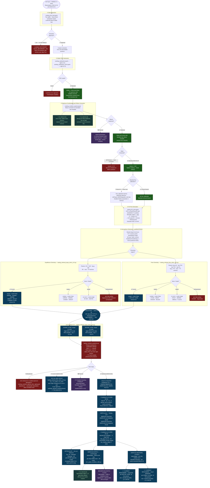

# DH Tau B · Atmospheric Retrieval Pipeline Cookbook

> **Purpose**: Track every pipeline decision, branching point, and retrieval series.
> Use the flowchart to identify exactly where to "rewind" when a downstream result is wrong.
>
> **Target**: DH Tau B — young super-Jupiter companion
> **Instrument**: CRIRES+ K-band (K2166), nights 2022-12-31 and 2023-01-01
> **Last updated**: 2026-07-20
> **Working directory**: `/data2/peng/Recipe_DH_Tau_B/`
> **Primary log**: `/data2/peng/recording_recipe.md`

---

> **How to edit this flowchart**
> - Edit the Mermaid block below directly in any text editor.
> - Preview in VS Code: install the *Markdown Preview Mermaid Support* extension → open Preview.
> - Or paste the `flowchart TD ... ` block at **mermaid.live** for an interactive editor.
> - Status labels: `✅ Selected` · `❌ Abandoned` · `🔵 Alt branch` · `🟣 Planned` · `⭐ Current best`

---

## Pipeline Flowchart

```mermaid
---
id: 828b37af-4e78-41c9-bbb2-38d4a49d38d6
---
flowchart TD
    %% ── Colour classes ──────────────────────────────────────────
    classDef sel  fill:#1e5c1e,color:#fff,stroke:#143d14,stroke-width:2px
    classDef aban fill:#7a1a1a,color:#fff,stroke:#4d0f0f,stroke-width:2px
    classDef curr fill:#0c3d5c,color:#fff,stroke:#082a40,stroke-width:2px
    classDef plan fill:#3d2b5c,color:#fff,stroke:#28194d,stroke-width:2px
    classDef mile fill:#5c4a0c,color:#fff,stroke:#3d3008,stroke-width:3px
    classDef fix  fill:#1a3a3a,color:#cfc,stroke:#0d2525,stroke-width:1px,stroke-dasharray:4 3

    %% ── START ───────────────────────────────────────────────────
    START(["DH Tau B · CRIRES+ K-band<br/>Observations: 2022-12-31 and 2023-01-01"])

    %% ─────────────────────────────────────────────────────────────
    subgraph SG1 ["① Data Inspection"]
        LOOK["cooking_first_look.ipynb<br/>Two nights · visual check<br/>Companion signal confirmed above stellar halo"]
    end

    START --> LOOK
    LOOK --> D_EXTR{"Extraction<br/>approach?"}

    D_EXTR -- "🔵 Alt — on-disk fallback" --> EXCAL["excalibuhr SECONDARY<br/>Extr1D_SECONDARY_*.fits<br/>direct 1D extraction with remove_star_bkg=True"]
    D_EXTR -- "✅ Selected" --> CUSTOM["Custom extraction<br/>from 2D intermediate products"]

    %% ─────────────────────────────────────────────────────────────
    subgraph SG2 ["② Stellar PSF Subtraction"]
        SUBTR["cooking_subtraction.ipynb — night 12-31<br/>cooking_subtraction_0101.ipynb — night 01-01<br/>"]
    end

    CUSTOM --> SUBTR
    SUBTR --> D_PSF{"PSF model?"}

    D_PSF -- "tested" --> LANDMAN["Landman et al. approach<br/>→Transmission modeled"]
    D_PSF -- "✅ Selected" --> MOFFAT["Moffat + Polynomial fitting<br/>→ 2D spectrum with starlight removed, Transmission (mtrans) from the stanadard star"]

    %% ─────────────────────────────────────────────────────────────
    subgraph SG3 ["③ Spectrum Combination and Telluric Correction"]
        COMB["cooking_combine_spectra.ipynb<br/>Telluric correction via standard-star template"]
        FIX1["🔧 Fix 2026-03-28<br/>Error array: stellar-noise variance<br/>replaced by sky-based variance"]
        FIX2["🔧 Fix 2026-03-28<br/>Wrong error files loaded for flux-cal step<br/>corrected to post-extraction files"]
        COMB --- FIX1
        COMB --- FIX2
    end

    MOFFAT --> COMB
    COMB --> D_TELL{"Telluric<br/>treatment?"}

    D_TELL -- "🟣 Planned" --> TELL_MODEL["Model transmission<br/>in retrieval forward model<br/>model spectrum × mtrans<br/>avoids data ÷ mtrans instability"]
    D_TELL -- "✅ Selected" --> TELL_MASK["Mask and correct with<br/>standard-star telluric template<br/>(mtrans from molecfit)"]

    TELL_MASK --> D_MASK{"Mask<br/>threshold?"}

    D_MASK -- "❌ Previous — over-correction" --> M70["mtrans &lt; 0.70<br/>Spurious emission at telluric positions"]
    D_MASK -- "✅ Selected 2026-03-29" --> M80["mtrans &lt; 0.80<br/>Tighter masking — fewer artifacts"]

    M80 --> D_CAL{"Absolute flux<br/>calibration?"}

    D_CAL -- "🔵 Branch A — future use" --> FLUXCAL["Flux-calibrated spectra<br/>SINFONI reference (DHTaub_SINFONIspeclib_JHK.fits)<br/>Enables Radius parameter in retrieval"]
    D_CAL -- "✅ Current branch" --> NOCAL["No flux calibration<br/>Standard retrieval branch"]

    %% ─────────────────────────────────────────────────────────────
    subgraph SG4 ["④ RV Prior Derivation"]
        RVCAL["tasting_RV_prior.ipynb<br/>CCF vs cloud-free pRT grid (SONORA P-T profiles)<br/>Teff 2000–2400 K · logg 3.7 · [Fe/H] +0.5<br/>→ CCF peak RV ≈ 32 km/s<br/>→ Retrieval prior: Gaussian N(32, σ) km/s"]
    end

    FLUXCAL --> RVCAL
    NOCAL   --> RVCAL

    %% ─────────────────────────────────────────────────────────────
    subgraph SG5 ["⑤ Atmospheric Retrieval — petitRADTRANS"]
        RETSET["Shared setup for all runs:<br/>T-P: 5 anchor points · photosphere range<br/>RV prior: N(32, σ) km/s<br/>Rotational broadening ε = 0.84 (Landman+2024)"]
        RETSET --> D_CHEM{"Chemistry<br/>regime?"}
    end

    RVCAL --> RETSET

    D_CHEM --> EQ_ROOT
    D_CHEM --> FR_ROOT

    %% ── Equilibrium chemistry branch ─────────────────────────────
    subgraph SG_EQ ["Equilibrium Chemistry — tasting_retrieval_equa_chem_v2.5.py"]
        EQ_ROOT["Params: C/O · Fe/H · log g · Teff<br/>RV · vsini · T-P anchors"]
        EQ_ROOT --> D_EQ{"Norm / Scale?"}
        D_EQ -- "✅ Current" --> EQ_SG["savgol + scale=False<br/>1839320 · 1843556 · 1858486<br/>1863374 · 1871127<br/>⭐ 2098448  N=600  mtrans&lt;0.8"]
        D_EQ -- "tested"     --> EQ_MED["median + scale=False<br/>1299032 · 1356656 · 1443825 · 1582187"]
        D_EQ -- "tested"     --> EQ_NONE["no norm + scale=single<br/>817303 · 1830783"]
        D_EQ -- "❌ Abandoned" --> EQ_CHIP["per-chip scaling<br/>degenerate with continuum normalisation"]
    end

    %% ── Free chemistry branch ────────────────────────────────────
    subgraph SG_FR ["Free Chemistry — tasting_retrieval_free_chem_v2.5.py"]
        FR_ROOT["Params: log H₂O · log ¹²CO · log ¹³CO · log CH₄<br/>log g · RV · vsini · T-P anchors"]
        FR_ROOT --> D_FR{"Norm / Scale?"}
        D_FR -- "✅ Current"  --> FR_SG["savgol + scale=False<br/>⭐ 2347145  N=600  mtrans&lt;0.8"]
        D_FR -- "tested"     --> FR_MED["median + scale=False<br/>272430 · 286207 · 2916434 · 3012201"]
        D_FR -- "tested"     --> FR_NONE["no norm + scale=single<br/>375227 · 2655966 · 2866411 · N-series"]
        D_FR -- "❌ Abandoned" --> FR_CHIP["per-chip scaling<br/>3143387 · degenerate"]
    end

    %% ── Milestone ────────────────────────────────────────────────
    EQ_SG --> MILE
    FR_SG --> MILE

    MILE(["⭐ MILESTONE — 2026-03-30<br/>C/O ratio and ¹²C/¹³C in broad agreement<br/>equil 2098448  ↔  free 2347145"])

    %% ── Two-night gradient T-P retrievals ───────────────────────
    subgraph SG_V3 ["v3.0 Gradient T-P — tasting_retrieval_equa_chem_v3.0.py"]
        V3_N1["2918065  N=600  savgol  no-scale<br/>Night 2022-12-31 only<br/>5653 samples · log Z = −23,749"]
        V3_N2["3041995  N=600  savgol  no-scale<br/>Night 2023-01-01 only<br/>4876 samples · log Z = −18,073"]
    end

    MILE --> V3_N1
    MILE --> V3_N2

    V3_N1 --> COMB_ATTEMPT
    V3_N2 --> COMB_ATTEMPT

    COMB_ATTEMPT["tasting_combine_posteriors.py<br/>Product-of-posteriors combination attempt<br/>ESS ≈ 1 — FAILED<br/>Root cause: vsini 4σ · nabla_RCE 4.5σ inter-night tension<br/>→ T-P multi-modality prevents joint posterior"]

    COMB_ATTEMPT --> D_NEXT{"Next steps"}

    D_NEXT -- "❌ Abandoned" --> JOINT_COMB["Joint retrieval on co-added spectrum<br/>attempted in cooking_combine_spectra_inter_night.ipynb<br/>abandoned — wavelength interpolation adds correlated noise"]
    D_NEXT -- "✅ Current (2026-04-03)" --> JOINT_RETR["Joint two-night retrieval<br/>tasting_retrieval_free_chem_v3.5.py<br/>ln_L = ln_L(N1) + ln_L(N2)<br/>each night compared on its own λ grid<br/>R per night from estimate_spectral_resolution(wave)<br/>ε = free param [0,1]"]
    D_NEXT -- "🟣 Planned" --> TP_GRAD["T-P Gradient Sampling<br/>dT/d(log P) parameterisation<br/>González Picos+2024 method<br/>(implemented in v3.0)"]
    D_NEXT -- "✅ Selected (2026-05-05)" --> CLOUDS["Cloud vs Cloud-free<br/>Guidebook v3.0 — EddySed (MgSiO3+Fe)<br/>005PM-FR-CLD / 005PM-EQ-CLD"]

    CLOUDS --> ATOMIC["⭐ Guidebook v4.0 (2026-06-04)<br/>Add HF · Na · Ca · Ti<br/>species_info.csv pRT3 names corrected<br/>Picos+2024 §4.2, Table 3"]

    ATOMIC --> V6["006PM series — Tasting v6.0<br/>006PM-FR cloud-free<br/>006PM-FR-CLD EddySed clouds<br/>006PM-EQ cloud-free<br/>006PM-EQ-CLD EddySed clouds"]

    V6 --> V42["⭐ Guidebook v4.2 (2026-06-12)<br/>Banded GP Cholesky — 4 bugs fixed<br/>chip_gap_nm 2.0→0.5 · precompute_K2166_ranges<br/>flux_scaling_rolling 7× faster"]

    V42 --> GP007["007PM-EQ-GP — flux-cal reference<br/>flux_cal · Standard Gaussian · GP<br/>job 2027997 (post-fix)  N=600<br/>Completed 2026-07-03 · Na/Ca still IN (22p)"]

    V42 --> RUF008["008PM-EQ-RUFFIO — Current goal<br/>sigmaclipper · Ruffio φ per chip<br/>per-chip median norm · GP<br/>script: v6.1_piette_cloudfree_ruffio.py"]

    V42 --> MEDNORM["008PM-EQ-MEDNORM, no Na/Ca<br/>sigmaclipper · per-chip median norm<br/>Standard Gaussian · GP · Na/Ca removed 2026-07-07"]
    MEDNORM --> MEDBM_CF["⭐⭐ CURRENT BENCHMARK — cloud-free<br/>job 3497146  N=600  19 free params<br/>lnZ=−18,046.0±0.2(NS) · χ²=1.04/0.96"]
    MEDNORM --> MEDBM_CLD["⭐⭐ CURRENT BENCHMARK — cloud (EddySed)<br/>job 3708914  N=1000  24 free params<br/>lnZ=−18,044.7±0.2(NS) · χ²=1.04/0.96"]

    RUF008_FIX["🔧 Fix 2026-06-20<br/>Sigmaclipper Night 2: 12 gap pixels deleted<br/>135 zero-error pixels masked"]
    RUF008 --- RUF008_FIX

    RUF008 --> RUF009["🟣 009PM-EQ-RUFFIO-CLOUD<br/>sigmaclipper · Ruffio φ · EddySed clouds<br/>MgSiO3+Fe · planned after 008 converges"]

    %% ── Class assignments ────────────────────────────────────────
    class MOFFAT,M80,NOCAL,TELL_MASK sel
    class EXCAL,LANDMAN,M70,EQ_CHIP,FR_CHIP,JOINT_COMB aban
    class EQ_SG,FR_SG,MILE curr
    class V3_N1,V3_N2 curr
    class JOINT_RETR curr
    class TP_GRAD,TRANS_FWD,TELL_MODEL plan
    class FIX1,FIX2,RUF008_FIX fix
    class COMB_ATTEMPT aban
    class CLOUDS,ATOMIC,V6 curr
    class V42,GP007,RUF008 curr
    class RUF009 plan
    class MEDNORM,MEDBM_CF,MEDBM_CLD curr
```

---

## Retrieval Series Registry

Organised by pipeline era. Jobs without labelled norm/scale in folder name were early exploratory runs.
`Data` column: **cal** = absolute-flux-calibrated · **std** = standard (no flux cal) · **?** = unconfirmed.

### Era 0 — Pre-data-fix (featureless spectrum; SNR inflated by stellar photon noise variance)

| Job ID | Chemistry | Norm | Scale | Data | Outcome |
|---|---|---|---|---|---|
| 1528526 | free | scaling-only | yes | ? | Weak constraints; high abundance |
| 2655966 | free | — | — | ? | Entry incomplete |
| 2866411 | free | no norm | scaling | ? | RV lost |
| 2949918 | free | savgol | no | ? | RV [0,50]; log_H2O [-10,−1] |
| 3153293 | free | savgol | no (RV fixed) | ? | log g ~1.5, vsini ~0.8, unphysical |
| 772437  | free | no norm | yes RV[20,40] | ? | CO anomalously high |
| 1331743 | free | savgol | no RV[20,40] | ? | Anomalous C/O, ¹²C/¹³C |
| 1335073 | free | median | no | ? | vsini [5,15]; log g out of fit |
| 3139004 | free | — | — | ? | Early run |
| 889297  | free | — | — | ? | Early run |
| N600_ev0.5, N800_ev0.5, N1000_ev0.5 | free | no norm | — | ? | Early no-label runs |

### Era 1 — Post-sky-variance-fix, pre-error-file-fix (still mostly featureless)

| Job ID | Chemistry | Norm | Scale | Data | Outcome |
|---|---|---|---|---|---|
| 1582187 | equil | median | false | ? | Still featureless |
| 1830783 | equil | no norm | single | ? | Still featureless |
| **1839320** | equil | savgol | false | ? | **Best of 3; some features visible** |

### Era 2 — Post-error-file-fix (features recovering; systematic norm/scale testing)

| Job ID | Chemistry | Norm | Scale | Data | Outcome |
|---|---|---|---|---|---|
| 272430  | free  | median | false | ? | Free chem median baseline |
| 286207  | free  | median | false | ? | Free chem median |
| 375227  | free  | no norm | single | ? | Free chem no-norm |
| 2916434 | free  | median | false | ? | Free chem median |
| 3012201 | free  | median | false | ? | Free chem median |
| 3143387 | free  | no norm | per-chip | ? | **ABANDONED — per-chip degenerate** |
| 817303  | equil | no norm | single | ? | Equil no-norm baseline |
| 1299032 | equil | median | false | ? | Equil median |
| 1356656 | equil | median | false | ? | Equil median |
| 1443825 | equil | median | false | ? | Equil median |
| **1843556** | equil | savgol | false | ? | **First run showing actual features** |
| 1858486 | equil | savgol | false | std | No-flux-cal comparison run |
| 1863374 | equil | savgol | false | ? | With telluric diagnostics overlaid |
| 1871127 | equil | savgol | false | ? | Pre-telluric-threshold reference |

### Era 3 — Current (tightened telluric mask mtrans < 0.80, N=600)

| Job ID | Chemistry | Norm | Scale | Data | Outcome |
|---|---|---|---|---|---|
| **⭐ 2098448** | equil | savgol | false | std | **C/O and ¹²C/¹³C constrained — 2026-03-30** |
| **⭐ 2347145** | free  | savgol | false | std | **Broad agreement with 2098448 — 2026-03-30** |

### Era 4 — v3.0 Gradient T-P, per-night (2026-04-01)

Both nights run with `tasting_retrieval_equa_chem_v3.0.py` — gradient T-P parameterisation (González Picos+2024), equilibrium chemistry, savgol, no per-chip scaling, N=600, ev=0.5, mtrans < 0.80.

| Job ID | Night | N samples | log Z (NS) | Notes |
|---|---|---|---|---|
| **2918065** | 2022-12-31 | 5653 | −23,749.6 | Gradient T-P; higher T_bottom (3233 K), log_P_RCE = −0.27 |
| **3041995** | 2023-01-01 | 4876 | −18,072.5 | Gradient T-P; lower T_bottom (2657 K), log_P_RCE = −1.28 |

**Inter-night tension** (attempted posterior product — ESS ≈ 1):

| Parameter | Night 1 | Night 2 | Tension |
|---|---|---|---|
| vsini | 6.45 km/s | 5.57 km/s | **4.0σ** |
| nabla_RCE | 0.125 | 0.064 | **4.5σ** |
| log_P_RCE | −0.27 | −1.28 | **3.2σ** |
| rv | 31.61 km/s | 31.92 km/s | 2.9σ |
| C/O | 0.272 | 0.352 | 2.2σ |

The T-P gradient parameterisation is multi-modal at single-night SNR; the two nights converge to different modes. **Solution: joint two-night retrieval (Era 5 below).**

Script: `tasting_combine_posteriors.py` · Output: `/data2/peng/retrievals/combined_2918065_3041995/`

### Era 5 — Joint two-night retrieval (2026-04-03)

`tasting_retrieval_free_chem_v3.5.py` — joint log-likelihood across both nights; gradient T-P; free chemistry; savgol norm; no per-chip scaling.

**Architecture changes** (see `recording_recipe.md` 2026-04-03 entry for full details):
- `PMN_lnL` evaluates `ln_L = ln_L(N1) + ln_L(N2)` with each night on its own wavelength grid
- `instr_broadening`: `in_res = 1e6/lbl_opacity_sampling = 333333`; `out_res` per night from `estimate_spectral_resolution(wave_3d)` = median(λ/Δλ_pixel) across all chips
- `_make_raw_spectrum()` cached within one PMN_lnL call → pRT runs once per evaluation
- `epsilon` (limb-darkening for `fastRotBroad`) is a free parameter with prior [0, 1]
- Night-1: `extracted_spectra_combined_sigmaclipper.npy`; Night-2: `extracted_spectra_combined_sigmaclipper_0101.npy`

| Job ID | Chemistry | Norm | Nights | Status |
|---|---|---|---|---|
| TBD | free | savgol | N1+N2 joint | pending |

### Era 6 — Guidebook v3.0 EddySed Cloud Model (2026-05-05)

`Guidebook_GAStronomy_Piette_v3.0.py` adds Ackerman & Marley (2001) EddySed cloud model.
Cloud species: MgSiO3(s)_crystalline_000 + Fe(s)_crystalline_000 (Xuan+2024 §4.3.3).

| Job ID | Script | Chemistry | Clouds | Status |
|--------|--------|-----------|--------|--------|
| **3766037** | `tasting_retrieval_equa_chem_v5.0_piette_cloud.py` | Equilibrium | MgSiO3+Fe | Complete |
| TBD | `tasting_retrieval_free_chem_v5.0_piette_cloud.py` | Free | MgSiO3+Fe | — |

### Era 7 — Guidebook v4.0: Atomic Species HF, Na, Ca, Ti (2026-06-04)

`Guidebook_GAStronomy_Piette_v4.0.py` adds HF, Na, Ca, Ti as retrieved species following
Picos et al. (2024) §4.2. Priors: `U(−12, −2)` log VMR for all four species.
Equilibrium chemistry uses a hybrid mode: eq table for molecular species, free VMR for atoms.
species_info.csv corrected: `HF→1H-19F`, `Na→23Na`, `Ti→48Ti`, `Ca→40Ca`.

| Script | Series | Chemistry | Clouds | Status |
|--------|--------|-----------|--------|--------|
| `tasting_retrieval_free_chem_v6.0_piette_cloudfree.py` | 006PM-FR | Free | None | Ready to run |
| `tasting_retrieval_free_chem_v6.0_piette_cloud.py` | 006PM-FR-CLD | Free | MgSiO3+Fe | Ready to run |
| `tasting_retrieval_equa_chem_v6.0_piette_cloudfree.py` | 006PM-EQ | Equilibrium | None | **Complete — job 368546** (8124 samples, [F/H]); job 37412 (6943, pre-[F/H]); Running — job 39068 |
| `tasting_retrieval_equa_chem_v6.0_piette_cloud.py` | 006PM-EQ-CLD | Equilibrium | MgSiO3+Fe | Ready to run |

### Era 8 — Guidebook v4.2: Ruffio Per-Chip φ Likelihood + Sigmaclipper Data (2026-06-12 →)

`Guidebook_GAStronomy_Piette_v4.2.py` — banded GP Cholesky, four correctness bugs fixed,
`chip_gap_nm` 2.0→0.5, `precompute_K2166_ranges` cache (flux_scaling_rolling 7× faster).
Scripts use `tasting_retrieval_equa_chem_v6.1_piette_cloudfree*.py`.

**Project strategy (superseded — see Era 9 below)**: The cloud-free, Piette P-T, flux_cal +
Gaussian retrieval (007PM-EQ-GP) originally served as the benchmark. As of 2026-07-20 the
standing benchmark pair is the Era 9 mednorm/no-Na/Ca series (jobs 3497146 cloud-free /
3708914 cloud) — the current adopted model excludes Na/Ca, so the flux_cal 007PM-EQ-GP run
(job 2027997, 22 params, Na/Ca still included) is kept only as the absolute-flux calibration
reference, not the primary benchmark. See [[project_retrieval_framework_paper_notes]] for the
open reconciliation question this raises for the paper's Methods section. The goal is still to
reproduce consistent results using the sigmaclipper dataset and the Ruffio per-chip φ
likelihood (008PM-EQ-RUFFIO), then add cloud properties (009PM-EQ-RUFFIO-CLOUD).

| Job ID | Series | Script suffix | Data | Likelihood | Clouds | Status |
|--------|--------|---------------|------|-----------|--------|--------|
| **⭐ 2195179** | 007PM-EQ-GP | `_cloudfree.py` | flux_cal | Standard Gaussian | None | **Complete — BENCHMARK** |
| 3286785 | 008PM-EQ-RUFFIO | `_cloudfree_ruffio.py` | flux_cal | Ruffio φ | None | **Failed** (NFS saturation at init) |
| 2777844 | 008PM-EQ-RUFFIO | `_cloudfree_ruffio.py` | flux_cal | Ruffio φ | None | Completed (diagnostic) |
| 3385718 | 008PM-EQ-RUFFIO | `_cloudfree_ruffio.py` | sigmaclipper | Ruffio φ | None | **Hung** (gap-pixel ValueError) |
| 111202  | 008PM-EQ-RUFFIO | `_cloudfree_ruffio.py` | sigmaclipper | Ruffio φ | None | **Killed** (wrong rv_N2 from un-normalized gap pixels) |
| TBD | **008PM-EQ-RUFFIO** | `_cloudfree_ruffio.py` | **sigmaclipper** | **Ruffio φ** | None | **Ready to run** (gap-pixel fix applied) |
| TBD | 009PM-EQ-RUFFIO-CLOUD | `_cloudfree_ruffio.py` + clouds | sigmaclipper | Ruffio φ | MgSiO3+Fe | Planned |

**Data notes for 008PM-EQ-RUFFIO** (script: `tasting_retrieval_equa_chem_v6.1_piette_cloudfree_ruffio.py`):
- Night 1: `extracted_spectra_combined_sigmaclipper.npy`
- Night 2: `extracted_spectra_combined_sigmaclipper_0101.npy` — 135 zero-error pixels masked; 12 gap pixels (outside all K2166 boundaries) deleted before Target creation
- Normalisation: per-chip median on data only (model not normalised; φ absorbs ratio)
- log_M + log_R replaced by log_g N(3.64, 0.20) — no absolute flux scaling

### Era 9 — Per-Chip Median Norm, Standard Gaussian, GP, No Na/Ca (2026-07-07 → superseded 2026-08-05)

Sidesteps SINFONI absolute flux calibration entirely: uses `extracted_spectra_combined_sigmaclipper*.npy`
(not flux_cal), divides data AND model by their own per-(order,detector)-chip median
(`normalize_flux='per_chip_median'` in Guidebook v4.2), Standard Gaussian likelihood
(`scale_flux=False`), banded-GP Cholesky covariance. Na (`23Na`) and Ca (`40Ca`) removed from
`EQ_SPECIES_PRT3`/`EQ_LABEL_NAMES` in `Guidebook_GAStronomy_Piette_v4.2.py` on 2026-07-07 (A/B
test vs. the with-Na/Ca precursor jobs 2968924/3160171 showed removal changes nothing —
ΔlnZ < 1 nat, all shared params shift <1σ; see `recording_recipe.md` 2026-07-08/09 entries).
This pair superseded 007PM-EQ-GP (job 2027997) as the primary reference (see Era 8 strategy
note above). **Superseded in turn on 2026-08-05 by Era 10 below** — per explicit user decision,
the standing benchmark must include Na/Ca opacity (just not as free parameters); this pair
carries no Na/Ca opacity at all, so it's now kept only as the opacity-inertness A/B comparison,
not the primary reference.

| Job ID | Series | Clouds | N_live | Free params | lnZ (NS) | lnZ (INS) | χ² (N1/N2) | Status |
|--------|--------|--------|--------|--------------|----------|-----------|------------|--------|
| 3497146 | 008PM-EQ-MEDNORM (no Na/Ca) | None | 600 | 19 | −18,046.04 ± 0.21 | −18,064.29 ± 0.49 | 1.0420 / 0.9598 | Complete — superseded (no-opacity comparison) |
| 3708914 | 008PM-EQ-CLD-MEDNORM (no Na/Ca) | MgSiO3+Fe (EddySed) | 1000 | 24 | −18,044.73 ± 0.16 | −18,072.81 ± 0.30 | 1.0415 / 0.9593 | Complete — superseded (no-opacity comparison) |

**Open caveat**: ¹²CO/¹³CO ≈ 130–145 for both jobs (vs. ~49–51 under absolute-flux
calibration); ¹³CO is not CCF-detected in either (SNR ~4.2–4.3 at rv ≈ −543 km/s) — a mednorm
normalisation systematic, still unresolved as of 2026-07-20 (confirmed to persist unchanged
under Era 10's Na/Ca opacity too — see below). Precursor jobs (with Na/Ca, kept
for the A/B record): 2968924 (cloud-free) / 3160171 (cloud). No-¹³CO ablation: job 170416
(moderate evidence FOR keeping ¹³CO in the model despite the non-detection, ΔlnZ ≈ +3.4–4.9).

### Era 10 — ⭐⭐ CURRENT BENCHMARK: Na/Ca Opacity Restored, Zero New Free Params (2026-07-20 →, promoted 2026-08-05)

Same data/normalisation/likelihood/GP as Era 9 (sigmaclipper, per-chip median norm, Standard
Gaussian, banded-GP Cholesky) but on Guidebook `v4.2.5`: `'23Na'`/`'40Ca'` uncommented in
`EQ_SPECIES_PRT3`/`EQ_LABEL_NAMES` so their opacity is back in `calculate_flux()`'s line list,
while `log_Na`/`log_Ca` remain absent from every `make_free_params_*()` function — abundances
fall out entirely of the existing `C_H`/`C/O` free parameters (Na via the native pRT3
equilibrium-table lookup; Ca via a new `VMR_Ca = VMR_Ca,solar(Lodders 2020) × 10**ZH` block).
Free-parameter counts are unchanged from Era 9 (19 cloud-free / 24 cloud). **Promoted to the
standing benchmark 2026-08-05 per explicit user decision: benchmark retrievals must include
Na/Ca opacity but must not carry them as free parameters** — this closes the open
paper-reconciliation question in [[project_retrieval_framework_paper_notes]] as option (b)
there, now on firmer footing since it's opacity-inclusive rather than opacity-absent.

**Tie-break rule (2026-08-05, user instruction): when two retrievals share an exactly
identical setup, the newer job ID is the designated benchmark.** 51459 and 430784 are
confirmed identical configs (same script, same 27-key `final_params_dict` structure, dT
priors verified byte-identical — 430784 was intended as a dT-prior-widened successor but the
edit landed in the wrong function, so it ended up a pure statistical repeat instead). Since
430784 (completed 2026-07-22 12:29) postdates 51459 (2026-07-21 15:22), **430784 is the
designated cloud-free benchmark, not 51459** (corrected 2026-08-05 — an earlier pass at this
table had it backwards). This also means `plot_paper.ipynb`'s Figures 2/A.1, which already
source their model spectrum from 430784, were correct all along.

| Job ID | Series | Clouds | N_live | Free params | lnZ (INS) | χ² (N1/N2) | Status |
|--------|--------|--------|--------|--------------|-----------|------------|--------|
| **⭐⭐ 430784** | 008PM-EQ-MEDNORM-ATOMOPAC | None | 600 | 19 | −18,062.84 | 1.041 / 0.958 | **Complete — CURRENT BENCHMARK (cloud-free; newer of two identical-setup jobs)** |
| 51459 | 008PM-EQ-MEDNORM-ATOMOPAC | None | 600 | 19 | −18,062.82 | 1.0418 / 0.9597 | Complete — superseded by 430784 (same setup, older); kept as the original opacity-axis test |
| **⭐⭐ 1001064** | 008PM-EQ-CLD-MEDNORM-ATOMOPAC | MgSiO3+Fe (EddySed) | 600 | 24 | −18,072.53 | 1.0418 / 0.9594 | **Complete — CURRENT BENCHMARK (cloud)** — sole real job in this config, no duplicate exists |

**Note on 1001064**: its `N_points` is 600 on disk, not 1000 like its Era-9 counterpart
3708914 — the script's own comment/docstring still claims 1000 (stale). Its own
`retrieval_model_*.npy` post-processing was missing on disk until 2026-08-05 (same
MPI-rank-not-guarded OOM pattern as 3708914) — regenerated via a single-process `evaluate()`
call; recomputed posterior/lnZ/χ² matched the pre-existing saved values exactly. Posterior
analysis completed 2026-08-05: every shared parameter vs. 3708914 (its no-opacity twin) agrees
to <0.4σ. **CCF validation (§18) completed 2026-08-05**: H2O/¹²CO/totalCO all genuine rv=0
detections (SNR 34.6/17.2/17.3); ¹³CO not detected (SNR 4.24 at −543 km/s, same offset as every
other mednorm run); **Na/Ca show NO significant detection** — Na SNR 4.21 at −337.0 km/s, Ca
SNR 2.99 at +540.0 km/s, both landing at the *exact same* spurious velocities as 51459's own
Na/Ca CCF, strong evidence of a shared repeatable data systematic rather than a real signal.
Na/Ca opacity confirmed inert in the cloud model on both the posterior and CCF axes, closing
this exactly as it was already closed for the cloud-free benchmark.

---

## Data Quality Changelog

| Date | Fix | Location | Impact |
|---|---|---|---|
| 2026-03-28 | Sky-based variance in optimal extraction | `cooking_subtraction.ipynb` cell `cb54cffb` | SNR recovered from < 0.1 to > 1 |
| 2026-03-28 | Correct error files loaded for flux-cal step | `cooking_combine_spectra.ipynb` flux-cal cell | Propagated errors now match post-fix extraction |
| 2026-03-28 | LPU error propagation for nod combination | `cooking_combine_spectra.ipynb` cell `76d9c6c3` | Combined errors now formally propagated: √(σ_A²+σ_B²)/N |
| 2026-03-29 | Raised telluric mask from 70% to 80% | `cooking_combine_spectra.ipynb` telluric cell | Removed spurious emission at partially-absorbed telluric pixels |
| 2026-04-03 | `fastRotBroad` ε: 0.5→free param [0,1] | `tasting_retrieval_free_chem_v3.5.py` `_make_raw_spectrum` | ε retrieved from data; prior physically bounded |
| 2026-04-03 | `instr_broadening`: per-night R from data | `tasting_retrieval_free_chem_v3.5.py` `estimate_spectral_resolution` | R computed as median(λ/Δλ_pixel) per chip; replaces hardcoded 100000 |
| 2026-04-07 | `self.FeH` → `self.C_H`; [C/H] formula cited | `tasting_retrieval_equa_chem_v3.4.5.py` `free_chemistry()` | Attribute and local variable renamed for consistency; formula comment cites Pico+2025: [C/H] = log10(n_C/n_H) − log10(n_C/n_H)_solar |
| 2026-06-04 | `species_info.csv` pRT3 names corrected: HF→1H-19F, Na→23Na, Ti→48Ti, Ca→40Ca | `Recipe_DH_Tau_B/species_info.csv` | Stale names (HF_main_iso, Na_allard, Ti, Ca) replaced with verified directory names in `/net/lem/data2/pRT3_formatted/input_data/opacities/lines/line_by_line/` |
| 2026-06-04 | Guidebook v4.0: HF, Na, Ca, Ti added as opacity sources | `Guidebook_GAStronomy_Piette_v4.0.py` | EQ_SPECIES_PRT3, equilibrium_chemistry(), and parameter functions all updated; 4 new log VMR free params U(−12,−2) per Picos+2024 Table 3 |
| 2026-06-12 | Guidebook v4.2: banded GP Cholesky (4 correctness bugs fixed) | `Guidebook_GAStronomy_Piette_v4.2.py` `CovarianceGP` | `lower=True` fix; diagonal includes `a²` term; `abs(diff)` for negative inter-order gaps; `try/except LinAlgError` in PMN_lnL |
| 2026-06-19 | `chip_gap_nm` 2.0→0.5; `precompute_K2166_ranges` cache | `Guidebook_GAStronomy_Piette_v4.2.py` | Inter-detector gaps (~1 nm) now correctly split sub-chips; `flux_scaling_rolling` 7× faster (51 ms→7 ms per call) |
| 2026-06-20 | Sigmaclipper Night 2: 12 gap pixels deleted before Target | `tasting_retrieval_equa_chem_v6.1_piette_cloudfree_ruffio.py` | Gap pixels (0.001–0.019 nm outside K2166 bounds) caused `cho_solve_banded` ValueError → every PMN_lnL returned −1e101; deletion eliminates the sub-chip size mismatch |
| 2026-06-20 | Sigmaclipper Night 2: 135 zero-error pixels masked | `tasting_retrieval_equa_chem_v6.1_piette_cloudfree_ruffio.py` | `err==0` pixels set to NaN to prevent division-by-zero in Ruffio φ likelihood |

---

## Future Pathways Backlog

Listed in rough priority order.

1. **Era 10 — PROMOTED TO CURRENT BENCHMARK 2026-08-05 (see Era 10 section above for the live
   status table).** History below kept for the build/verification record. Na/Ca opacity back
   into the model, zero new free parameters.
   Version table:

   | Component | File | Status |
   |---|---|---|
   | Guidebook | `Guidebook_GAStronomy_Piette_v4.2.5.py` | Built + dry-run verified |
   | Script (cloud-free) | `tasting_retrieval_equa_chem_v6.1.5_piette_cloudfree_mednorm_atomopac.py` | Built + dry-run verified — 19 free params, matches 3497146 |
   | Script (cloud) | `tasting_retrieval_equa_chem_v6.1.5_piette_cloud_mednorm_atomopac.py` | Built + dry-run verified — 24 free params, matches 3708914 |

   Verified end-to-end (real `Retrieval` construction, real Radtrans opacity loading of
   `23Na__Kurucz` and `40Ca__Kurucz`, one finite `PMN_lnL` evaluation each) before considering this
   ready to launch — see `recording_recipe.md` §2026-07-20 "Plan implemented" for the full
   verification log, including the confirmed Lodders (2020) value `LOG_CA_H_SOLAR = -5.73`
   (previously only an approximate placeholder).

   **LAUNCHED AND COMPLETE (2026-07-21): job 51459** (cloud-free, 008PM-EQ-MEDNORM-ATOMOPAC, 19
   free params, confirmed no `log_Na`/`log_Ca`). **Result: Na/Ca opacity is confirmed fully inert**
   — every shared parameter agrees with 3497146 (its no-opacity twin) to <1σ (lnZ −18,062.8 vs
   −18,064.3±0.5; C/O 0.587 vs 0.597; ¹²CO/¹³CO 142 vs 144; vsini 5.91 vs 6.01). The still-open
   ¹²CO/¹³CO≈140 mednorm-inflation puzzle is unchanged by adding real Na/Ca opacity, ruling that
   out as its explanation. This closes the Na/Ca question on both the parameter-count axis
   (2026-07-07/08 A/B) and the opacity axis (this run) — see
   [[project_retrieval_framework_paper_notes]].

   **Job 430787 (launched 2026-07-21, in progress) — dT-prior mismatch, NOT yet a valid
   prior-sensitivity test.** User intended to widen the equilibrium-mode dT priors and relaunch;
   verified the actual on-disk edit (Guidebook v4.2.5, saved 14:11:40, one minute before launch)
   landed in `make_free_params_free_chem()`, not `make_free_params_equilibrium()` — the function
   this job's script (`chemistry='equilibrium'`) actually calls. `make_free_params_equilibrium()`
   is confirmed byte-identical to the original v4.2. **430787 is therefore running with the same
   dT priors as 51459**, not fine-tuned ones, pending user confirmation/fix. Full diff and line
   numbers in `recording_recipe.md` §2026-07-21.

   **Na/Ca CCF validation for 51459 (2026-07-21): NO significant detection.** Added §16 to
   `Reminisce/tasting_retrieval_validation_clean.ipynb` using Guidebook v4.2.5 (v4.2 would
   silently skip Na/Ca again, as it did for 3497146/3708914's own CCF sections) and the full
   `TRACE_SPECIES_BASE`. Real, non-zero templates confirmed for both species (template_fraction
   5.4e-3 Na / 2.3e-3 Ca), but CCF peaks at unphysical velocities (Na: SNR 4.25 at −337 km/s; Ca:
   SNR 3.00 at +540 km/s) — the same noise-chasing pattern as HF/FeH/¹³CO in this run, versus
   genuine detections H2O (SNR 34.6, rv=0) and ¹²CO/totalCO (SNR ~17.2, rv=0). Also ran
   `Reminisce/tasting_retrieval_results_analysis_4.ipynb`'s 51459 section (spectrum, posterior,
   P-T, and a direct A/B vs 3497146 recomputed fresh from both posteriors — corrected, tighter
   agreement than the earlier memory-paraphrased numbers, all |Δ|/σ < 0.3). Full writeup and
   corrected comparison table: `recording_recipe.md` §2026-07-21 "analysis_4 + validation_clean
   run for 51459".

   **Job 430784 (2026-07-22): confirmed statistical repeat of 51459, not a distinct dT-prior
   test.** Re-verified `make_free_params_equilibrium()`'s dT priors are still unchanged from
   51459's — every shared parameter agrees to <0.3σ (C/O and ¹²CO/¹³CO match to 4 decimal
   places). Same analysis_4/validation_clean workflow re-run (rid_E / §17). **Na/Ca CCF: same
   non-detection** — Na SNR 4.22 at −337 km/s (same spurious peak as 51459 exactly), Ca SNR 3.04
   at the ±1000 km/s search-range edge (vs +540 km/s for 51459 — an unstable peak location that
   itself argues against a real Ca signal, unlike H2O/CO which lock to rv=0 in both independent
   runs). Full comparison table and CCF numbers in `recording_recipe.md` §2026-07-22.

   **Job 1001064 (launched 2026-07-22, in progress) — cloud-model counterpart of the Na/Ca-opacity
   benchmark.** Series 008PM-EQ-CLD-MEDNORM-ATOMOPAC, script
   `tasting_retrieval_equa_chem_v6.1.5_piette_cloud_mednorm_atomopac.py`, 24 free params (cloud-free
   19 + 5 EddySed cloud params), same treatment as 3708914 was to 3497146 in the original A/B.
   **Note**: `N_points` on disk is 600, not 1000 as the file's own comment/docstring claim (that
   figure matched 3708914's precedent, not this run) — the live-point count was edited without
   updating the stale text. Flagged for when comparing against 3708914 (N=1000) — worth checking
   whether N=600 undersamples this 24-parameter, 5-cloud-dimension posterior. Full note:
   `recording_recipe.md` §2026-07-22 "Job 1001064 launched".
   **In this new retrieval: the model spectrum WILL include Na and Ca opacity, and both
   abundances are computed from parameters already in the sampler (`C_H`, `C/O`) — no dedicated
   atomic free parameter is added for either.** Mechanism differs by species: Na's abundance
   comes straight out of the existing pRT3 equilibrium-table interpolation (Na is a native table
   species, driven by `C_H`/`C/O` exactly like H2O/CO/CH4); Ca's abundance is set by a new model
   equation, `VMR_Ca = VMR_Ca,solar(Lodders 2020) × 10**ZH`, where `ZH` (metallicity) is already
   derived internally from that same `C_H`/`C/O` pair — Ca is not in the table itself. Verified
   directly against the installed pRT3 table (`PreCalculatedEquilibriumChemistryTable().species`):
   **Na IS a native equilibrium-table species; Ca (and Ti) are NOT** — the Guidebook v4.2
   docstring at `equilibrium_chemistry()` claiming otherwise for Na is stale/wrong.
   Implementation: (a) uncomment `'23Na'` in `EQ_SPECIES_PRT3`/`EQ_LABEL_NAMES`, no new free-param
   code needed (`elif simple in mf_eq` branch already exists, line 1253); (b) add the new Ca
   injection block (mirrors the existing HF block in shape, but keyed to `ZH` not a dedicated
   parameter) and uncomment `'40Ca'`. Plan: patch to Guidebook v4.3, correct the stale docstring,
   then launch a cloud-free/cloud pair with the **same param count as 3497146/3708914 (19/24)** to
   test whether Na/Ca *opacity* (as opposed to sampler freedom, already ruled inert by the
   2026-07-07/08 A/B) moves anything. Full derivation and step-by-step plan: `recording_recipe.md`
   §2026-07-20 "Investigation: can Na/Ca opacity re-enter the model spectrum WITHOUT adding free
   parameters?". Feeds directly into the open Na/Ca paper-reconciliation question — see Era 9 note
   above.

2. **008PM-EQ-RUFFIO — Ruffio + Sigmaclipper (IN PROGRESS)** — Reproduce the 007PM-EQ-GP benchmark (job 2195179, flux_cal + Gaussian) using sigmaclipper data and the Ruffio per-chip φ likelihood. Script ready; gap-pixel and zero-error-pixel fixes applied. Launch when cluster is available.

3. **009PM-EQ-RUFFIO-CLOUD — Add clouds (PLANNED)** — Same sigmaclipper + Ruffio setup as 008; add EddySed cloud parameters (log_P_base, f_sed, log_X_cloud for MgSiO3+Fe) once 008 converges consistently with the benchmark.

4. **Two-Night Joint Retrieval (Pathway 1) — deferred** — The posterior-product combination attempt (2026-04-01) revealed that the gradient T-P parameterisation is multi-modal at single-night SNR, with vsini (4σ) and nabla_RCE (4.5σ) inter-night tensions. The only rigorous solution is to run a single retrieval on the combined spectrum: (a) measure per-chip wavelength offset between nights via CCF against the molecfit telluric template; (b) apply offset correction; (c) co-add with LPU error propagation; (d) run `tasting_retrieval_equa_chem_v3.0.py` on the combined data. Expected gain: ~√2 SNR → T-P profile pinned to a single mode. Pre-existing plan: `/data2/peng/recording_recipe.md` § 2026-03-28, Pathway 3.

5. **T-P Gradient Sampling (v3.0)** — Implemented in `tasting_retrieval_equa_chem_v3.0.py` and `tasting_retrieval_free_chem_v3.0.py`. Deployed in Era 4 runs (2918065, 3041995). Further tuning of prior bounds (especially `log_P_RCE`, `nabla_RCE`) may help reduce multi-modality.

6. **Transmission in Forward Model** — instead of dividing data by `mtrans`, multiply the pRT model spectrum by `mtrans` before likelihood evaluation. More stable at partially-absorbed pixels. Requires modification of the likelihood function in both retrieval scripts.

7. **Absolute-calibrated Data Retrievals** — run Era 3/4 configuration on flux-calibrated spectra (Branch A) to enable the planetary Radius parameter in the prior.

8. **excalibuhr SECONDARY as Cross-check** — use `Extr1D_SECONDARY__COMBINED_*.fits` (already on disk at `/data2/peng/2022-12-31/out/combined/`) as an independent extraction for comparison. Plan saved at `/data2/peng/plan_alternative_secondary_extraction_2026-03-28.md`.

---

*Add new retrieval series to the registry table and new decision nodes to the flowchart as the project evolves.*
